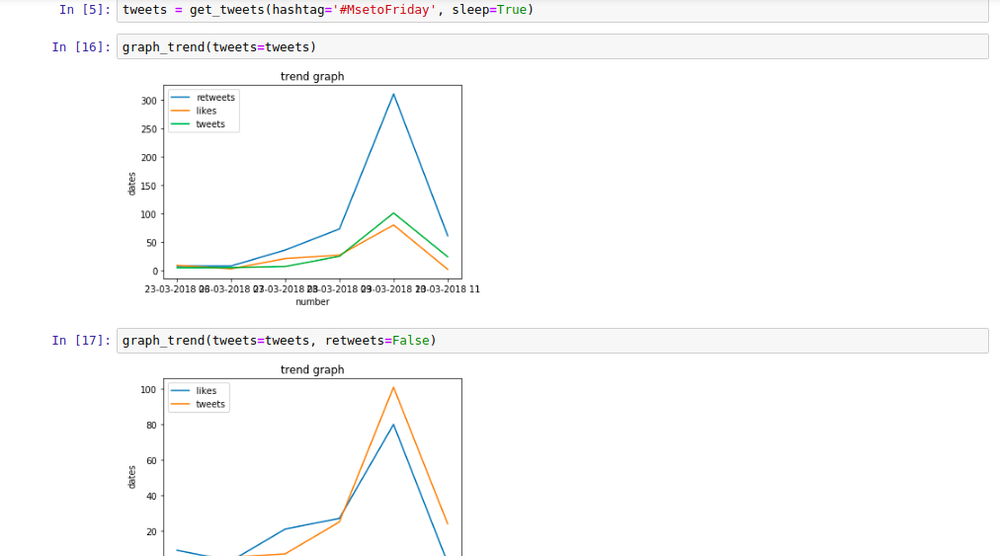

# trend-chart
Snippet of code that can parse tweets from a hashtag and show the trend over time.

You get the tweets, retweets and likes plotted to get a visual "feel" of what's going on... is it mainly retweets (with the hashtag) or is there a good amount of original tweets (tweets usually outnumber retweets, it's the frequency that counts). And the likes. Just as a feel of possibly an additional passive group of tweeters looking at the content.

The dates get squished though on the graph plot. Will fix this soon.

The code is available in the ipython notebook or the additional chart.py file.
